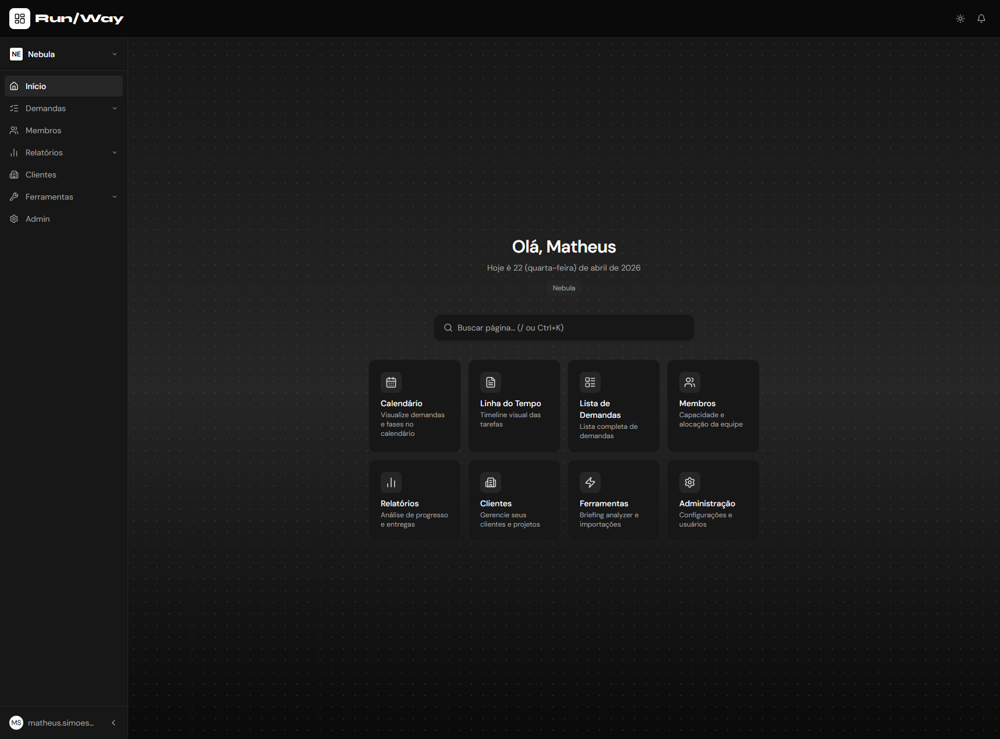

<div align="center">

# ⚡ Run/Way

**Capacity planning visual para times de design e desenvolvimento.**
Gerencie demandas, acompanhe fases de entrega e visualize a carga da equipe — tudo em tempo real.

<br/>

<br/>


</div>

---

## ✨ O que é o Run/Way?

O Run/Way é uma aplicação web de **capacity planning** para equipes de criação. Com ele você:

- 📋 **Cria e gerencia demandas** com fases de entrega encadeadas automaticamente (Design → Approval → Dev → QA)
- 📅 **Visualiza no calendário** mensal com drag-and-drop de tarefas
- 📊 **Acompanha no Gantt** — timeline por fase com arrastar e soltar
- 👥 **Monitora a capacidade** de cada membro da equipe em tempo real
- 🔔 **Recebe notificações** de tarefas atrasadas, membros sobrecarregados e novos integrantes
- 🌙 **Dark mode** nativo com preferência persistida por usuário
- 🔐 **Login seguro** via Google OAuth com controle de domínio

---

## 🗂️ Documentação

| Área | Arquivo |
|---|---|
| 🏛️ Arquitetura e fluxo de dados | [docs/architecture.md](docs/architecture.md) |
| 📅 DashboardView, Calendário, Timeline | [docs/views/dashboard.md](docs/views/dashboard.md) |
| ✅ TasksView, filtros, ActionMenu | [docs/views/tasks.md](docs/views/tasks.md) |
| 👥 MembersView, capacidade | [docs/views/members.md](docs/views/members.md) |
| 🛡️ AdminView, painel de usuários | [docs/views/admin.md](docs/views/admin.md) |
| 🙍 ProfileView, preferências | [docs/views/profile.md](docs/views/profile.md) |
| 🪟 TaskModal, cascata de fases | [docs/components/task-modal.md](docs/components/task-modal.md) |
| 🎨 Design system (Button, Input, Badge…) | [docs/components/ui.md](docs/components/ui.md) |
| 🪝 useSupabase, CRUD, steps | [docs/hooks/supabase.md](docs/hooks/supabase.md) |
| 🔑 useAuth, login | [docs/hooks/auth.md](docs/hooks/auth.md) |
| 🔔 useNotifications, NotificationBell | [docs/hooks/notifications.md](docs/hooks/notifications.md) |
| 📆 dateUtils, dias úteis, cascadePhases | [docs/utils/date-utils.md](docs/utils/date-utils.md) |
| 🛠️ ToolsView, BriefingAnalyzerView | [docs/views/tools.md](docs/views/tools.md) |
| 📐 Convenções e padrões | [docs/guidelines.md](docs/guidelines.md) |
| 🗺️ Decisões arquiteturais (ADRs) | [docs/decisions.md](docs/decisions.md) |
| 📝 TODOs e melhorias pendentes | [docs/todo/melhorias.md](docs/todo/melhorias.md) |

---

## 🚀 Começando

### Pré-requisitos

- Node.js 18+
- Conta no [Supabase](https://supabase.com) com projeto criado
- Google OAuth configurado no Supabase

### Instalação

```bash
# 1. Clone o repositório
git clone <url-do-repositório>
cd run-way

# 2. Instale as dependências
npm install

# 3. Configure as variáveis de ambiente
cp .env.example .env
# Edite o .env com suas credenciais

# 4. Inicie o servidor de desenvolvimento
npm run dev
```

Acesse em **http://localhost:5173**

---

## ⚙️ Variáveis de Ambiente

| Variável | Descrição |
|---|---|
| `VITE_SUPABASE_URL` | URL do projeto Supabase |
| `VITE_SUPABASE_ANON_KEY` | Chave pública (anon) do Supabase |
| `VITE_SUPABASE_SERVICE_ROLE_KEY` | Chave de service role do Supabase |
| `VITE_GOOGLE_CLIENT_ID` | Client ID do Google OAuth |
| `VITE_ALLOWED_DOMAIN` | Domínio permitido para login (ex: `empresa.com.br`) |
| `VITE_REDIRECT_ALLOWED_ORIGINS` | Origens permitidas no redirect OAuth (separadas por vírgula) |
| `VITE_REDIRECT_ALLOWED_PATHS` | Paths permitidos no redirect OAuth (ex: `/,/auth/callback`) |
| `VITE_SESSION_MAX_AGE_HOURS` | Duração máxima da sessão em horas (mínimo efetivo: 48) |

---

## 🛠️ Comandos

```bash
npm run dev        # Servidor de desenvolvimento — localhost:5173
npm run build      # Build de produção (tsc + vite build)
npm run lint       # ESLint
npm run test       # Testes em modo watch (Vitest)
npm run test:run   # Testes em modo CI (execução única)
```

---

## 🗃️ Modelo de Dados

### Fases de entrega

Cada demanda passa por 4 fases com **cascata automática de datas** em dias úteis:

| Fase | ⏱️ Duração padrão | 🎨 Cor |
|---|---|---|
| 🎨 Design | 5 dias úteis | Violeta |
| ✅ Approval | 3 dias úteis | Laranja |
| 💻 Dev | 7 dias úteis | Azul |
| 🧪 QA | 3 dias úteis | Esmeralda |

### Entidades principais

**Task** — demanda com fases de entrega
- `status`: `backlog` · `em andamento` · `bloqueado` · `concluído`
- `phases`: cada fase com `start` e `end` no formato `YYYY-MM-DD`

**Member** — membro da equipe
- `role`: `Designer` | `Developer`
- `access_role`: `admin` | `user`

---

## 🏗️ Stack

| Camada | Tecnologia |
|---|---|
| Frontend | React 19 + TypeScript 5.9 + Vite 8 |
| Estilização | Tailwind CSS v4 (plugin Vite) |
| Backend / DB | Supabase (PostgreSQL + Auth + Edge Functions) |
| Estado / Cache | TanStack Query v5 + Zustand |
| UI Primitivos | Radix UI + Lucide React + Sonner |
| Testes | Vitest |
| CI/CD | GitHub Actions |

---

## 🔒 Segurança e CI/CD

| Workflow | Trigger | O que faz |
|---|---|---|
| `secrets.yml` | push + PR→main | Scan de secrets com Gitleaks |
| `test.yml` | push + PR→main | Vitest + ESLint em paralelo |
| `codeql.yml` | push/PR→main + semanal | Análise de vulnerabilidades CodeQL |
| `tag-version.yml` | push→main | Tag git automática ao bumpar versão |
| `no-friday-deploy.yml` | PR→main | Bloqueia merge às sextas-feiras |

---

<div align="center">

Feito com ☕ pelo time Run/Way

</div>
