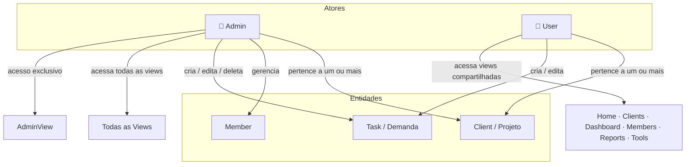

# User Flow & Diagrama de Usuários — Capacity Dashboard

**Data:** 2026-04-10  
**Escopo:** Fluxo de telas e funcionalidades por perfil, diagrama de atores e relacionamentos

---

## 1. Diagrama de Atores e Relacionamentos



**Relacionamentos principais:**

- Ambos os perfis pertencem a um ou mais `Client` (projetos/contas)
- `Admin` tem acesso total, incluindo `AdminView` (exclusiva)
- `User` não acessa `AdminView`
- Ambos podem criar e editar `Tasks`; apenas `Admin` pode deletar
- `Member` é a entidade que representa o usuário no sistema (com `role`: Designer ou Developer)
- Usuários não se auto-cadastram — contas são criadas pelo Admin

---

## 2. Fluxo de Login

Dois caminhos conforme o perfil, divergindo após autenticação:

```
[Tela de Login]
  │
  ├── Usuário digita e-mail + senha
  ├── Clica em "Entrar"
  │     ├── Erro → exibe mensagem de erro na tela (credenciais inválidas)
  │     └── Sucesso → AuthContext carrega session + member + clients
  │
  ├── Se perfil = Admin
  │     └── → HomeView (sidebar exibe todas as views, incluindo AdminView)
  │
  └── Se perfil = User
        └── → HomeView (sidebar sem AdminView)
```

**Estados na tela de Login:**

- Campo e-mail + campo senha
- Botão "Entrar" (desabilitado durante carregamento)
- Loading enquanto autenticação ocorre
- Mensagem de erro se credenciais inválidas
- Sem opção de cadastro (usuários são criados pelo Admin)

---

## 3. Visão Geral da Navegação

Após login, o usuário navega via **sidebar** (sempre visível) e **header** com seletor de client:

```
[HomeView]
  │
  ├── Seleciona Client no Header
  │     └── Persiste no localStorage; necessário para views marcadas com *
  │
  └── Sidebar → navega para:
        ├── [UserClientsView]     — lista de clients do usuário
        ├── [DashboardView] *     — requer client selecionado
        ├── [MembersView] *       — requer client selecionado
        ├── [ReportsView] *       — requer client selecionado
        ├── [ToolsView]           — não requer client
        └── [AdminView]           — somente Admin, não requer client
```

**Regra de acesso a views com client obrigatório:**  
Se o usuário tentar acessar Dashboard, Members ou Reports sem client selecionado, é direcionado a selecionar um client primeiro.

---

## 4. Fluxo Detalhado por Tela

### HomeView

- Exibe saudação com nome do membro logado
- **SearchLauncher:** campo de busca que filtra tarefas por título/assignee em tempo real
- **QuickAccess:** cards clicáveis que navegam para Dashboard, Members e Reports
- Sem ações de criação ou edição

---

### UserClientsView

- Lista todos os clients aos quais o usuário tem acesso
- Clica em um client → define como client ativo (persiste no localStorage) → navega para HomeView
- **Admin:** vê todos os clients do sistema
- **User:** vê apenas os clients aos quais está associado

---

### DashboardView *(requer client)*

Ponto central de gerenciamento de demandas. Dois modos alternáveis:

**Modo Calendário (CalendarView):**
- Grade mensal com tarefas posicionadas por fase e data
- Drag-and-drop para mover tarefas (ajusta datas)
- Clica em tarefa → abre TaskModal em modo edição

**Modo Timeline/Gantt (TimelineView):**
- Barras horizontais por fase (Design, Approval, Dev, QA)
- Drag-and-drop por fase individualmente
- Clica em tarefa → abre TaskModal em modo edição

**Ações disponíveis:**
- Botão "Nova Demanda" → abre TaskModal em modo criação

**TaskModal — Criação / Edição:**

| Campo | Descrição |
|---|---|
| Título | Nome da demanda |
| Assignee | Membro responsável |
| Status | `backlog` · `em andamento` · `bloqueado` · `concluído` |
| Link ClickUp | URL opcional |
| Fase Design | Data início e fim |
| Fase Approval | Data início e fim |
| Fase Dev | Data início e fim |
| Fase QA | Data início e fim |

- **Cascata automática:** ao alterar a data de uma fase, as fases seguintes se ajustam automaticamente
- Botão **Salvar** → persiste no Supabase → atualiza cache local
- **Admin:** botão Deletar disponível
- **User:** sem botão Deletar

---

### MembersView *(requer client)*

- Lista membros do client ativo (Designers e Developers)
- Para cada membro: nome, role, avatar/iniciais, indicador de carga (tasks ativas vs capacidade)
- Exibe tasks atribuídas por membro
- Somente leitura — sem criação ou edição de membros aqui

---

### ReportsView *(requer client)*

- Métricas de carga ativa do client (tarefas concluídas excluídas das métricas)
- Distribuição por status: backlog · em andamento · bloqueado
- Carga por membro: estimativa de dias/horas por fase ativa
- Somente leitura — sem interações de edição

---

### ToolsView

- Grid de tool cards com ferramentas utilitárias
- Clica em card → exibe detalhes da ferramenta
- Disponível para Admin e User
- Atualmente em desenvolvimento (skeleton/mocks, sem dados reais)

---

### AdminView *(somente Admin)*

- Gestão de membros e configurações globais do sistema
- Criação de novos usuários
- Configurações que afetam todos os clients
- Inacessível para perfil User

---

## 5. Diferenças por Perfil

| Funcionalidade | Admin | User |
|---|---|---|
| Login | ✅ | ✅ |
| HomeView | ✅ | ✅ |
| UserClientsView | ✅ (todos os clients) | ✅ (apenas os seus) |
| DashboardView | ✅ | ✅ |
| MembersView | ✅ | ✅ |
| ReportsView | ✅ | ✅ |
| ToolsView | ✅ | ✅ |
| AdminView | ✅ | ❌ |
| Criar tarefa | ✅ | ✅ |
| Editar tarefa | ✅ | ✅ |
| Deletar tarefa | ✅ | ❌ |
| Ver todos os clients | ✅ | ❌ |
| Gerenciar membros/usuários | ✅ | ❌ |
